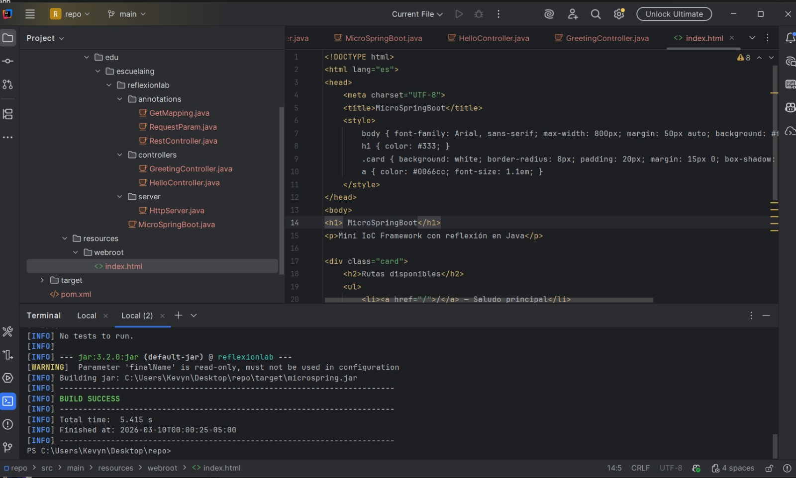
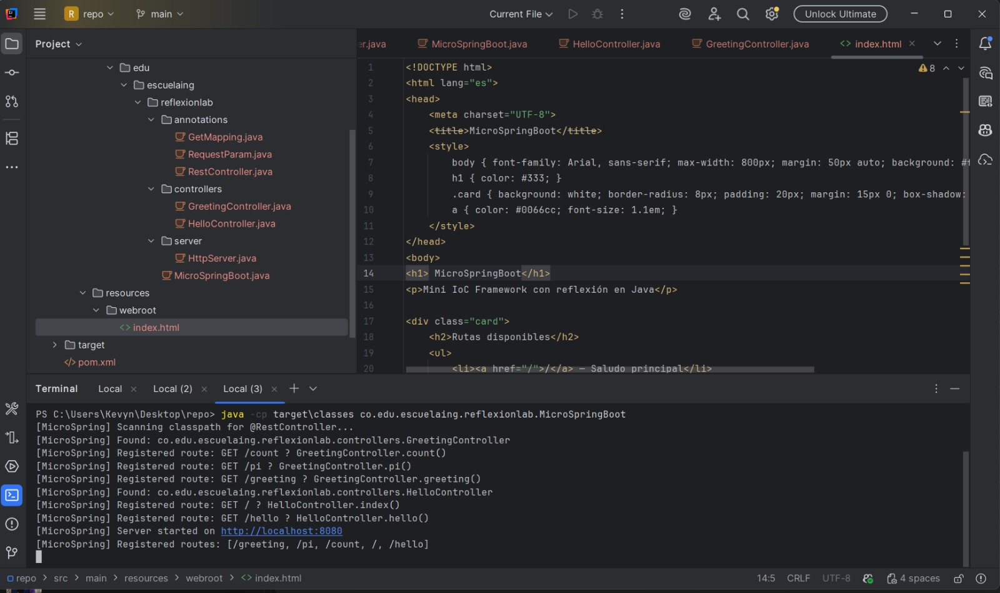
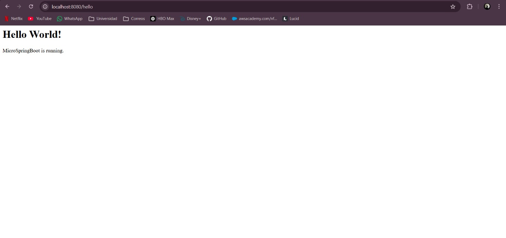
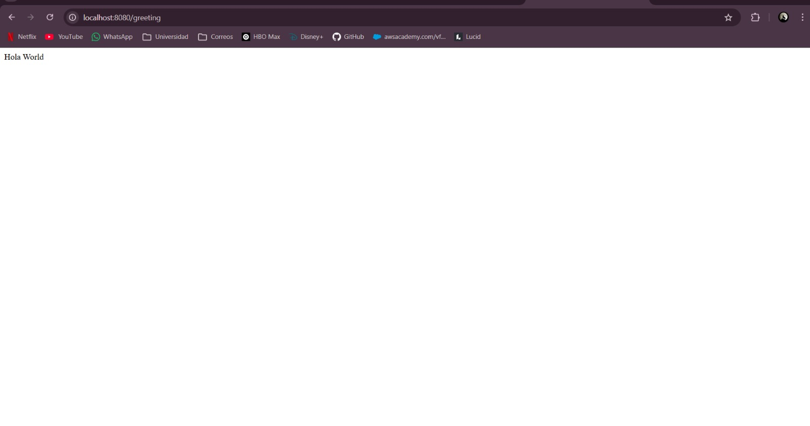
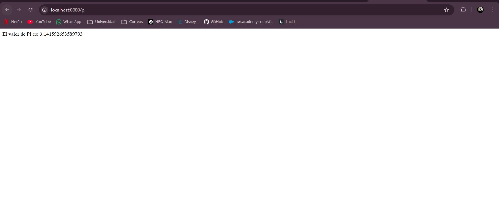
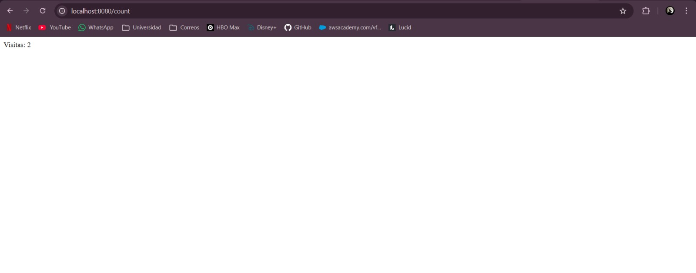
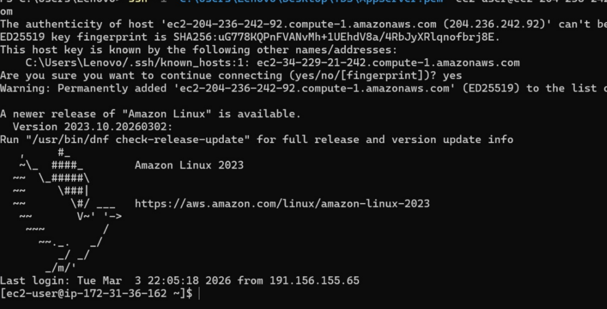
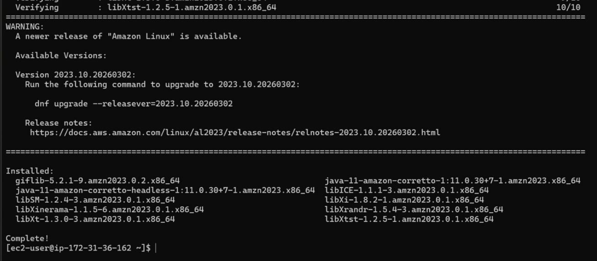
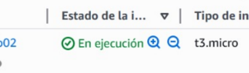

# MicroSpringBoot — Reflexion Lab

Un servidor web HTTP construido desde cero en Java puro, con un framework IoC (Inversión de Control) inspirado en Spring Boot. Utiliza las capacidades de **reflexión de Java** para descubrir y registrar automáticamente controladores web a partir de anotaciones.

---

## Descripción

Este proyecto es un prototipo que demuestra las capacidades reflexivas de Java para construir un mini-framework web. El servidor es capaz de:

- Servir archivos estáticos (HTML, PNG, CSS, JS)
- Exponer endpoints REST a partir de POJOs anotados
- Escanear el classpath automáticamente buscando clases con `@RestController`
- Resolver parámetros de query string mediante `@RequestParam`
- Atender múltiples solicitudes de forma secuencial (no concurrente)

---

## Arquitectura

```
src/
└── main/java/co/edu/escuelaing/reflexionlab/
    ├── MicroSpringBoot.java          # Punto de entrada y scanner de classpath
    ├── annotations/
    │   ├── RestController.java       # Marca una clase como controlador web
    │   ├── GetMapping.java           # Mapea un método a una ruta HTTP GET
    │   └── RequestParam.java        # Inyecta parámetros de query string
    ├── controllers/
    │   ├── HelloController.java      # Controlador de ejemplo básico
    │   └── GreetingController.java   # Controlador con parámetros y rutas adicionales
    └── server/
        └── HttpServer.java           # Servidor HTTP, enrutador y handler de archivos estáticos
```

### Flujo de ejecución

```
MicroSpringBoot.main()
    │
    ├── [Con argumento]  → Carga la clase especificada por línea de comandos
    │
    └── [Sin argumento]  → Escanea el classpath buscando @RestController
                               │
                               └── HttpServer.registerController()
                                       │
                                       └── Registra rutas @GetMapping en routeMap
                                               │
                                               └── HttpServer.start() → Escucha en puerto 8080
```

---

## Anotaciones disponibles

| Anotación | Nivel | Descripción |
|---|---|---|
| `@RestController` | Clase | Marca el POJO como controlador HTTP. El framework lo descubre automáticamente. |
| `@GetMapping("/ruta")` | Método | Expone el método en la URI indicada como endpoint GET. Retorno debe ser `String`. |
| `@RequestParam(value="nombre", defaultValue="x")` | Parámetro | Inyecta el valor del query param en el parámetro del método. |

---

## Requisitos previos

- Java 11 o superior
- Maven 3.6+

---


## Endpoints disponibles

| Método | Ruta | Descripción | Ejemplo |
|---|---|---|---|
| GET | `/` | Mensaje de bienvenida del servidor | `curl http://localhost:8080/` |
| GET | `/hello` | Página HTML de saludo | `curl http://localhost:8080/hello` |
| GET | `/greeting` | Saludo personalizado con query param | `curl http://localhost:8080/greeting?name=Ana` |
| GET | `/pi` | Retorna el valor de π | `curl http://localhost:8080/pi` |
| GET | `/count` | Contador de visitas (AtomicLong) | `curl http://localhost:8080/count` |

### Ejemplos de respuesta

```

GET /greeting
→ Hola World

GET /pi
→ El valor de PI es: 3.141592653589793

GET /count
→ Visitas: 2
```

---


## Archivos estáticos

Los archivos HTML, PNG, CSS y JS deben ubicarse en:

```
src/main/resources/webroot/
```

Son servidos automáticamente cuando la ruta solicitada no coincide con ningún controlador. Por ejemplo, `http://localhost:8080/index.html` sirve el archivo `webroot/index.html`.

---

## Pruebas

```bash
mvn test
```

---

## Fotos








## Despliegue AWS



## Tecnologías utilizadas

- **Java 11** — Lenguaje principal
- **Java Reflection API** — Descubrimiento de controladores y resolución de parámetros en tiempo de ejecución
- **Java Sockets** — Implementación del servidor HTTP desde cero (`ServerSocket` / `Socket`)
- **Maven** — Gestión del ciclo de vida y dependencias
- **JUnit 4** — Pruebas unitarias

---

## Autor
Kevyn Daniel Forero Gonzalez
Escuela Colombiana de Ingeniería Julio Garavito  

